# SQL Assistant - Agentic AI-Powered Database Query Tool

## 🎯 Problem Statement

Traditional SQL query writing poses significant challenges for developers and data analysts:

- **Complex Syntax**: Writing syntactically correct SQL queries requires deep knowledge of database structures and SQL syntax
- **Multi-Dialect Confusion**: Different SQL dialects (MySQL, PostgreSQL, SQLite, Oracle, SQL Server, Amazon Aurora, etc.) have varying syntax and functions
- **Database Schema Understanding**: Users need to manually explore database schemas before writing effective queries
- **Query Optimization**: Writing efficient queries requires expertise in database optimization techniques
- **Natural Language Barrier**: Non-technical users struggle to translate business questions into SQL queries
- **Error-Prone Process**: Manual SQL writing is susceptible to syntax errors and logical mistakes
- **Query Execution Understanding**: Lack of understanding of how SQL queries are processed internally by database engines

## 💡 Solution

SQL Assistant is an **Agentic AI-powered** web application that revolutionizes database interaction by:

- **Natural Language Processing**: Convert plain English questions into accurate SQL queries
- **Multi-Dialect Support**: Generate SQL compatible with various database systems (MySQL, PostgreSQL, Oracle, SQL Server, Amazon Aurora)
- **Intelligent Schema Analysis**: Automatically understand and work with uploaded database structures
- **Real-Time Execution**: Execute generated queries and display results in user-friendly formats
- **Order of Execution Analysis**: Provide detailed step-by-step breakdown of how SQL queries are processed internally
- **Query Copy Functionality**: Easily copy generated SQL queries for use in other applications
- **Example Query Library**: Pre-built query examples to test and explore database functionality
- **Interactive Interface**: Provide an intuitive web-based platform for seamless database interaction

## 🛠️ Tools & Technologies

### **Backend Technologies**
- **Python Flask**: Web framework for building the application server
- **SQLAlchemy**: Database abstraction layer for multi-database support
- **SQLite**: Primary database engine for query execution
- **Mistral AI**: Large Language Model for natural language to SQL conversion
- **PhiData**: Agentic AI framework for intelligent query generation

### **Frontend Technologies**
- **HTML5 & CSS3**: Modern web interface design
- **Bootstrap 5**: Responsive UI components and styling
- **JavaScript**: Interactive frontend functionality
- **DataTables**: Advanced table display and manipulation

### **AI & Machine Learning**
- **Mistral Large**: Advanced language model for SQL generation
- **Agentic AI**: Intelligent agent system for context-aware query processing
- **Natural Language Processing**: Understanding user intent and context
- **Query Analysis**: Intelligent breakdown of SQL execution order

### **Database & File Handling**
- **Multi-format Support**: SQL files, database imports
- **Schema Analysis**: Automatic database structure detection
- **Query Optimization**: Intelligent query generation and execution
- **Multi-Dialect Conversion**: Support for MySQL, PostgreSQL, Oracle, SQL Server, Amazon Aurora

### **Development & Deployment**
- **Gunicorn**: Production WSGI server
- **Markdown2**: Documentation rendering
- **Nest Asyncio**: Asynchronous processing support

## 📊 Project Snapshots

### Main Interface

### Documentation System
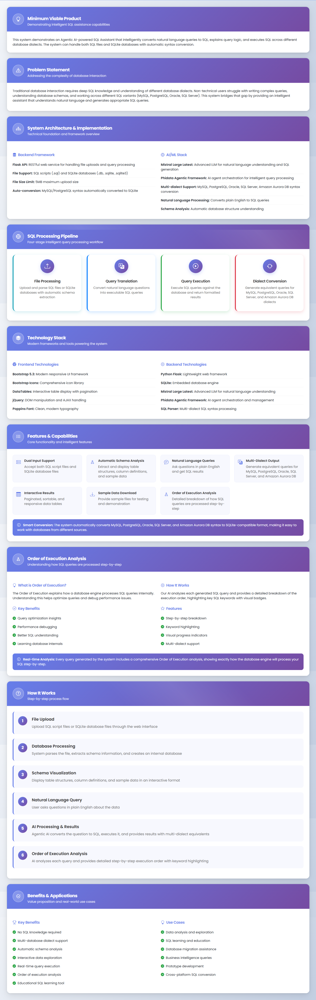

### File Upload & Download
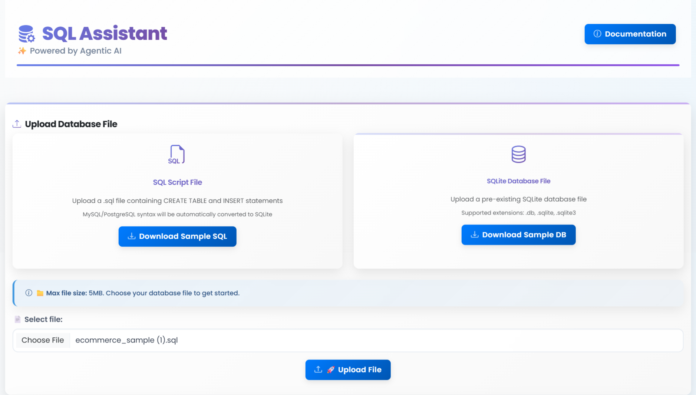

### Database Schema Display
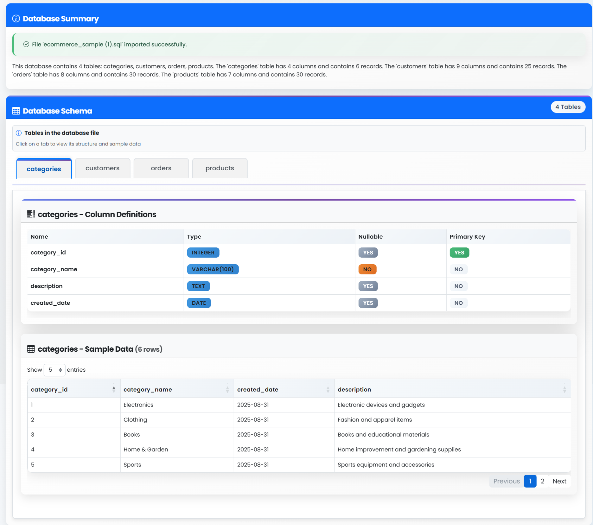

### Example Queries
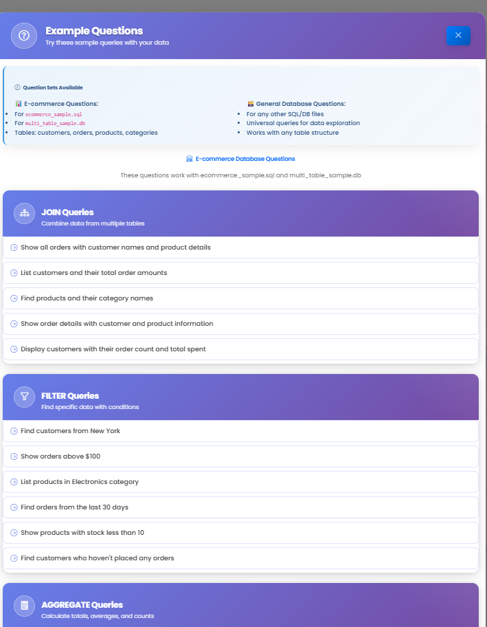

### Query Generation
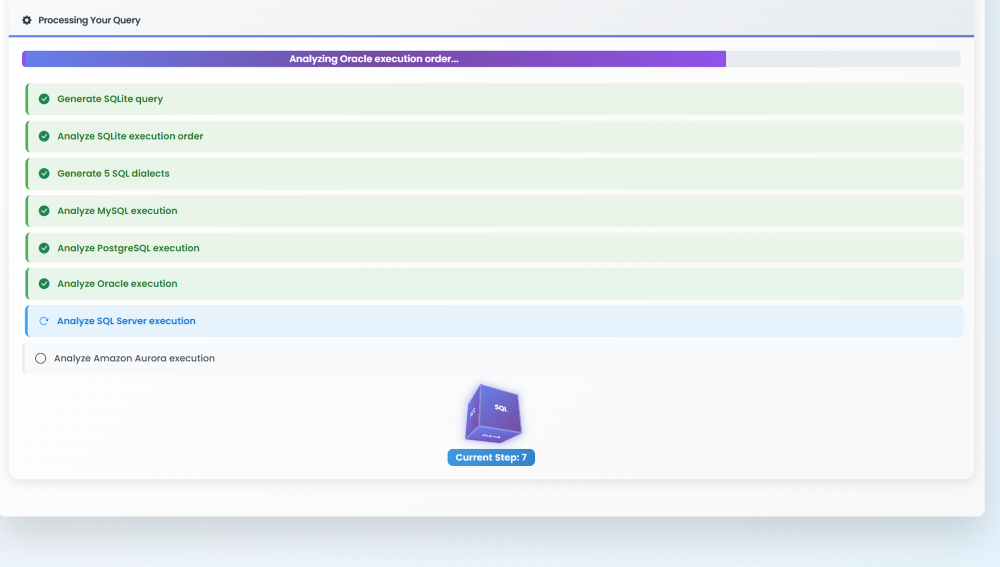

### SQLite Query Execution
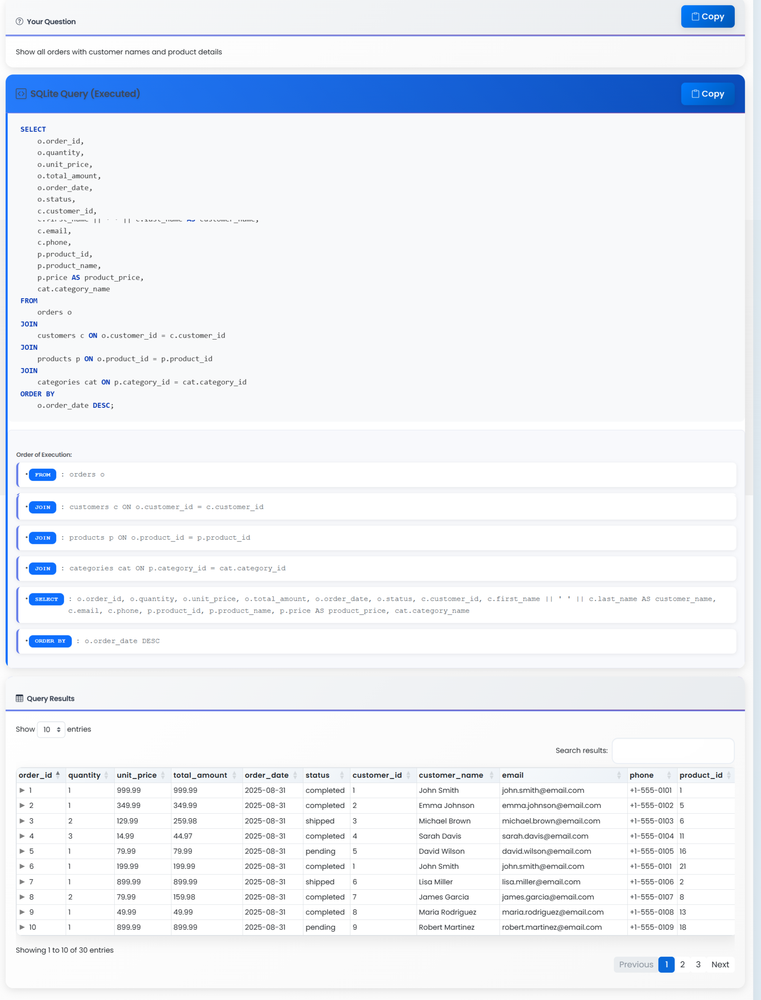

### MySQL Query with Order of Execution
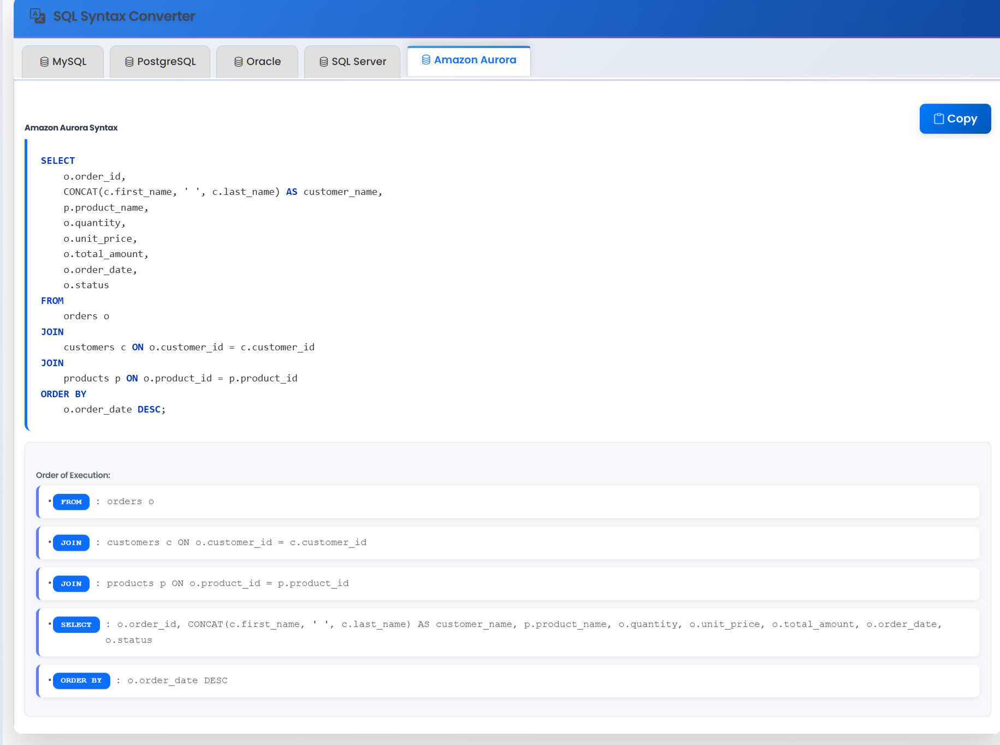

### PostgreSQL Query with Order of Execution
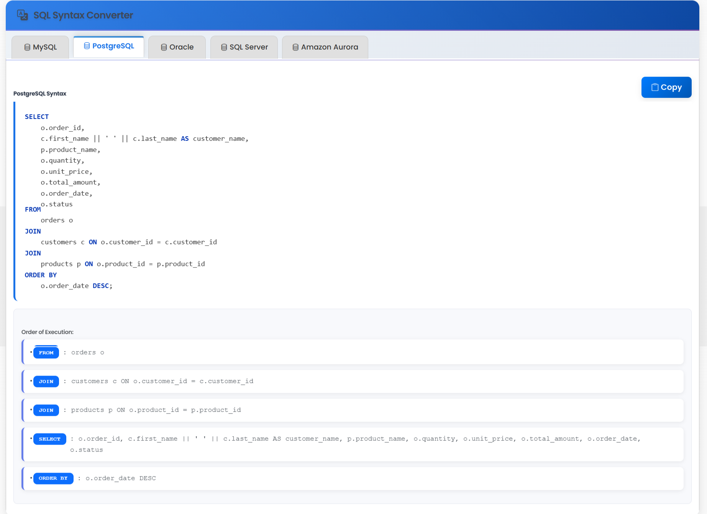

### Oracle Query with Order of Execution
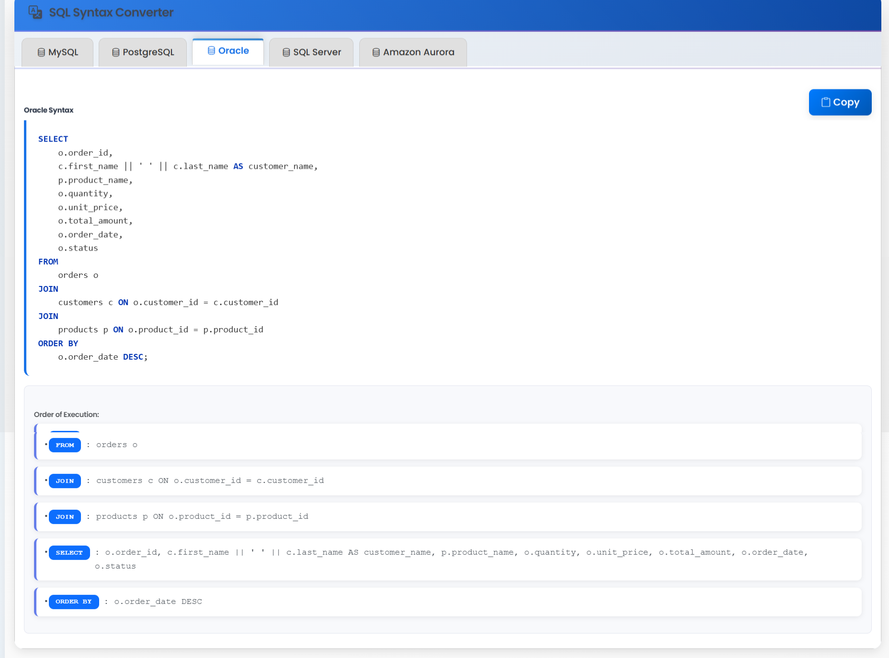

### SQL Server Query with Order of Execution
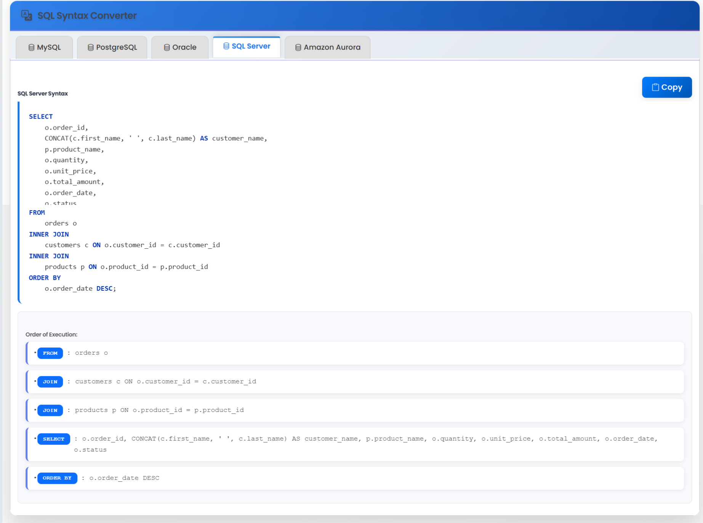

### Amazon Aurora Query with Order of Execution
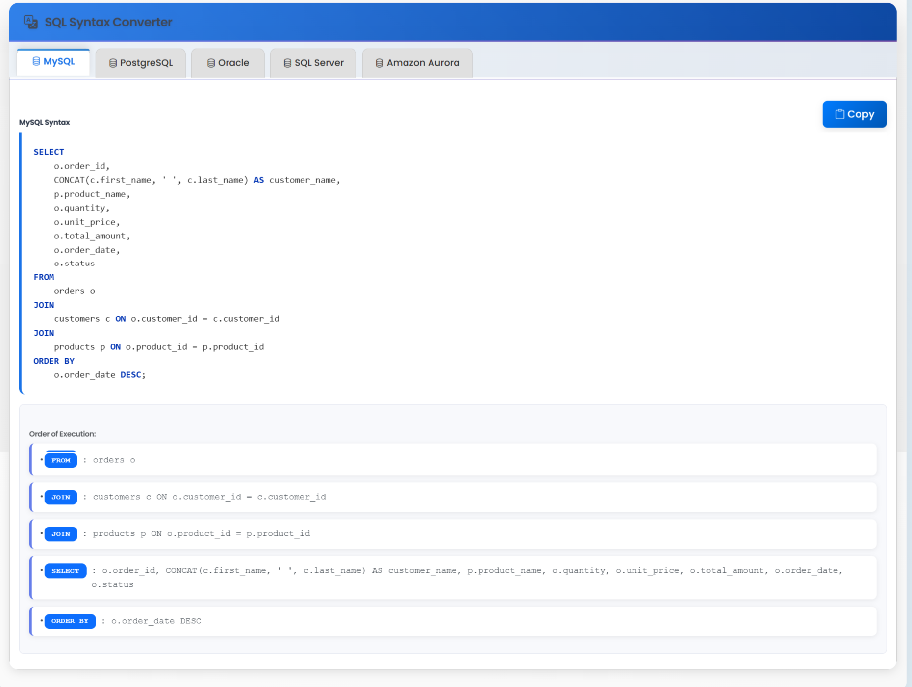

## 🎯 Problems Solved

### **For Data Analysts**
- **Rapid Query Development**: Generate complex queries in seconds instead of hours
- **Schema Exploration**: Instantly understand database structures without manual exploration
- **Multi-Database Support**: Work with different SQL dialects seamlessly
- **Query Understanding**: Learn how queries are executed internally with Order of Execution analysis

### **For Developers**
- **Reduced Development Time**: Focus on business logic instead of SQL syntax
- **Error Minimization**: AI-generated queries reduce syntax and logical errors
- **Query Optimization**: Leverage AI expertise for efficient query structures
- **Cross-Platform Compatibility**: Generate queries for multiple database systems

### **For Students & Learning Developers**
- **Complex Query Solutions**: Get instant help with challenging JOIN operations (LEFT, RIGHT, INNER, OUTER)
- **Filter Logic Assistance**: Understand and implement complex WHERE clause conditions
- **Learning Through Examples**: See how natural language translates to proper SQL syntax
- **Query Pattern Recognition**: Learn different approaches to solve similar database problems
- **Execution Order Learning**: Understand how database engines process SQL queries step-by-step

### **For Business Users**
- **Natural Language Interface**: Ask questions in plain English
- **Self-Service Analytics**: Reduce dependency on technical teams
- **Instant Results**: Get database insights without waiting for query development
- **Multi-Database Support**: Work with various database systems without learning different syntaxes

### **For Organizations**
- **Improved Productivity**: Faster database operations and analysis
- **Knowledge Democratization**: Enable non-technical users to access database insights
- **Cross-Platform Flexibility**: Support for multiple database systems reduces vendor lock-in

## 🚀 Future Enhancements

### **Advanced AI Features**
- **Performance Optimization**: AI-powered query performance suggestions
- **Auto-Completion**: Intelligent suggestions while typing natural language queries
- **Query History**: Learn from user patterns to improve suggestions
- **MCP (Model Context Protocol) Server Integration**: Standardized protocol for connecting AI models to external data sources and tools
- **SDK Transition**: Transition from current Mistral SDK to OpenAI SDK for broader compatibility
- **SLM & Local AI Support**: Small Language Models compatible with Ollama, Msty, Jan.ai, LM Studio, Llama.cpp and other local AI platforms

---

